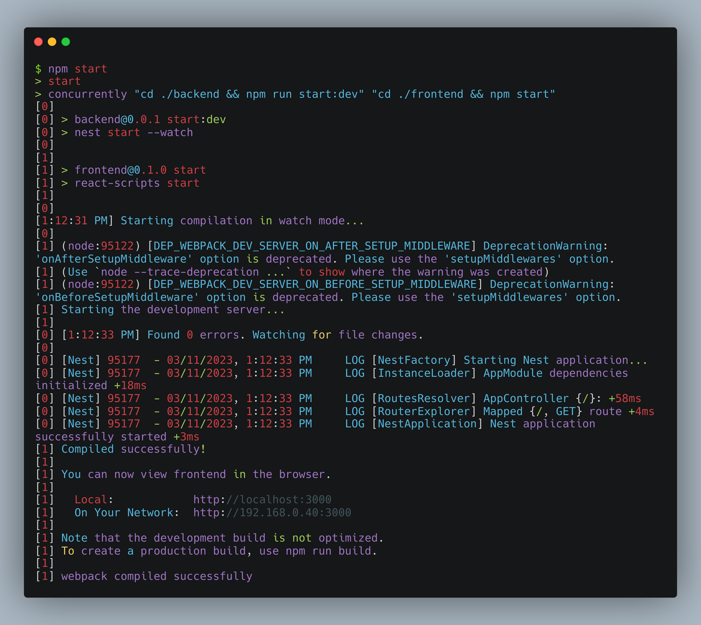

# voteDapp

- Create a voting dApp to cast votes, delegate and query results on chain
- Request voting tokens to be minted using the API
- Store a list of recent votes in the backend and display that on frontend

## Setup & Installation:

```shell
npm install
cd backend && npm install
cd frontend && npm install
```

## Setup ENV

```shell
touch .env
```

Add the following to your .env file

```shell
MNEMONIC=""
PRIVATE_KEY=""
INFURA_API_KEY=""
INFURA_API_SECRET=""
ALCHEMY_API_KEY=""
ETHERSCAN_API_KEY=""
```

Verify your hardhat configuration and dotenv setup.
In base directory deploy helloworld.sol contract on Sepolia

```shell
npx hardhat run scripts/deploy.ts --network sepolia
npx hardhat verify --network sepolia <0xcontractaddress>
```


To run the application manually:

## Backend NestJS

```shell
cd backend && npm start run:dev
```

## Frontend ReactJS

```shell
cd frontend && npm start
```

## Hardhat

```shell
npx hardhat help
npx hardhat test
REPORT_GAS=true npx hardhat test
npx hardhat node
npx hardhat run scripts/deploy.ts
```

To run the application automatically with one start script in base directory which will launch both backend and frontend:

```shell
npm start
```



## Contributors


